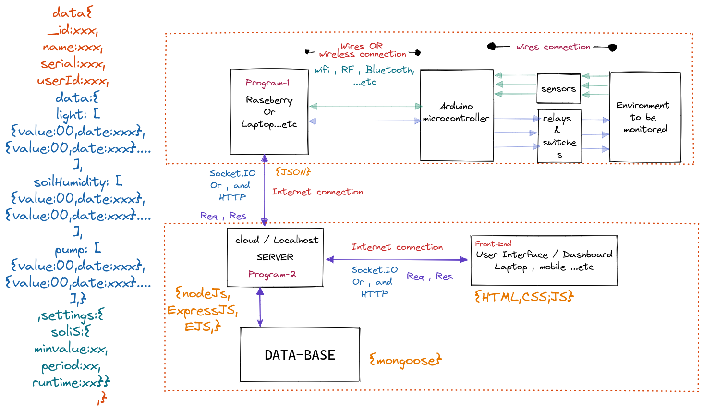

# green house micro controllers

## Project's Idea

The Idea for this project is to build a product from A to Z which will monitor a plant environment (temperature, light, soil humidity...etc), check the suitable values which will be entered by the user online dashboard, then automatically adjust the monitored plant environment.
Reading values from sensors connected to Raspberry Pi (Rasp Pi) GPIO pins and displaying the results on the command line is satisfying, but being able to access your sensors remotely is where things start getting useful.
Automatic Irrigation System

## Project Structure



## Technologies and third parties

    Hardware:
        - Raspberry Pi 4 B 8GB
        - RPI T-COBBLER
        - MCP3008
        - Digital Light intensity Sensor Module for Arduino
        - Soil Moisture Sensor Hygrometer Module V1.2 Capacitive Compatible with Arduino
        - Arduino Pump
        - Relay high trigger 5VDC
        - Cable Jumper 28 AWG Wire Bridges for Arduino Raspberry Pi
        - breadBoard MB102

    Software:
        - HTML
        - CSS
        - JS
        - NodeJs
        - "dependencies": {
                "bcryptjs": "^2.4.3",
                "cors": "^2.8.5",
                "dotenv": "^16.0.0",
                "ejs": "^3.1.6",
                "express": "^4.17.3",
                "express-session": "^1.17.2",
                "express-validator": "^6.14.0",
                "mongoose": "^6.2.7",
                "mongoose-unique-validator": "^3.0.0",
                "node-fetch": "^2.0",
                "nodemailer": "^6.7.2",
                "socket.io": "^4.4.1",
                "pristine.js.org",
                "reCaptcha",
                "ChartJs",
                         },
        - Raspberry side : 
                         {
                "express": "^4.17.3",
                "gpio": "^0.2.10",
                "johnny-five": "^2.1.0",
                "onoff": "^6.0.3",
                "raspI-io": "^11.0.0",
                "rpi-gpio": "^2.1.7",
                "rpiO": "^2.4.2",
                "socket.io": "^4.4.1",
                "socket.io-client": "^4.4.1"
                "node-fetch": "^2.6.1"
  }

## Analog_to_Digital_Signal

Receive an analog signal, convert it to digital, to be handled with micro controllers ARM processors using MCP3008 IC.

Using Raspberry Pi4 and nodejs and python

Connect the MCP3008 pins to Raspberry pi in this order:

<pre>
         ____
  CH0 __|    |__VDD
  CH1 __|    |__VREF
  CH2 __|    |__AGND
  CH3 __|    |__CLK
  CH4 __|    |__Dout
  CH5 __|    |__Din
  CH6 __|    |__CS/SHDN
  CH7 __|____|__DGND
</pre>

<ol>
<li>MCP3008 (VDD) =======> Raspberry (3.3v)</li>
<li>MCP3008 (Vref) =======> Raspberry (3.3v)</li>
<li>MCP3008 (AGND) =======> Raspberry (GND)</li>
<li>MCP3008 (CLK) =======> Raspberry PIN23(SCLK)</li>
<li>MCP3008 (Dout) =======> Raspberry PIN21(MISO)</li>
<li>MCP3008 (Din) =======> Raspberry PIN19(MOSI)</li>
<li>MCP3008 (CS/SHDN) ====> Raspberry PIN22(CE0)</li>
<li>MCP3008 (DGND) =======> Raspberry (GND)</li>
</ol>

## project working tree

## User registration

    * status: Every new user must be created with “Pending” status by default. After registration, he will receive a confirmation email with an activation link. By clicking on it, his status will be updated to “Active”.
    * confirmationCode: A unique token for each user.


<br>
The Data stored in two collections: books and authors.
<br>
## Project's Packages
> In this Project, The following packages are used:
<br>
├── bootstrap@5.1.3<br>
├── dotenv@16.0.0<br>
├── ejs@3.1.6<br>
├── express@4.17.3<br>
├── jquery@3.6.0<br>
└── mongoose@6.2.3
## Project's Structure:

```sh
Root
├── data
│   ├── authors.json
│   └── books.json
├── models
│   └── mongo.js
├── public
│   ├── css
│   │   └── style.css
│   └── js
│       └── script.js
├── routes
│   ├── admin.js
│   └── index.js
├── views
│   ├── partials
│   │   ├── modal.ejs
│   │   └── navbar.ejs
│   ├── addAuthor.ejs
│   ├── addBook.ejs
│   ├── book.ejs
│   ├── error.ejs
│   ├── index.ejs
│   └── search.ejs
├── app.js
├── package.json
├── package-lock.json
├── .env
└── README.MD
```
## Project's Environmenet
> Create ```.env``` file and make sure to put those variables with your values in Atlas mongodb:
```sh
PORT=3000
# DONT USE 'USER' VARIABLE, it's reserved By SYSTEM!!!
DBUSER=<YOUR_CLUSTER_USER_IN_ATLAS>
PASSWORD=<YOUR_CLUSTER_PASSWORD>
DATABASE=bookstore
```
